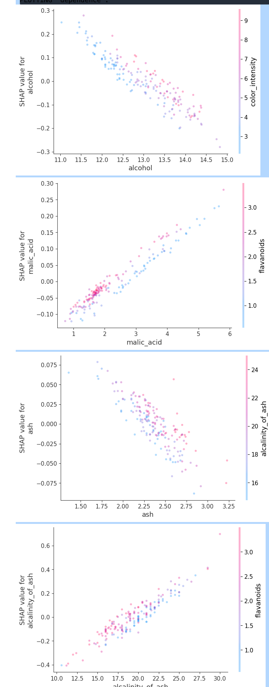

# shapwrap
A wrapper for easier and slightly more extended SHAP library usage. Just makes this easier to plug in and not worry about formatting of the package. 

Extended features:
- group categorical features effect via `summary_group`. Super useful if you use pd.get_dummies() in your pipelines, so a single feature gets obfuscated behind multiple dummies. This tried to group it back together by common prefix. 
- `feature_breakout` will calculate mean Shap contribution from a feature's value. The idea is to get a sense of which feature-value pairs are driving most of the model decisions and if it makes sense. 


# Setup
Install via:

```pip install shapwrap```

Followed this for pip package setup:
```https://betterscientificsoftware.github.io/python-for-hpc/tutorials/python-pypi-packaging/#what-is-pip```


# How to use

```
import pandas as pd
from sklearn.datasets import load_wine
from shapwrap.wrapper import ShapExplanation
from sklearn.linear_model import LinearRegression

data = load_wine(as_frame=True)
X, y = data.data, data.target

clf = LinearRegression()
clf = clf.fit(X, y)

expl = ShapExplanation(data=X, model = clf)

expl.plot(plot_type='summary', save_plot_path='summary.png')
expl.plot(plot_type='summary_group')
expl.plot(plot_type='decision_paths')
expl.plot(plot_type='feature_breakout')
expl.plot(plot_type='dependence')
```





